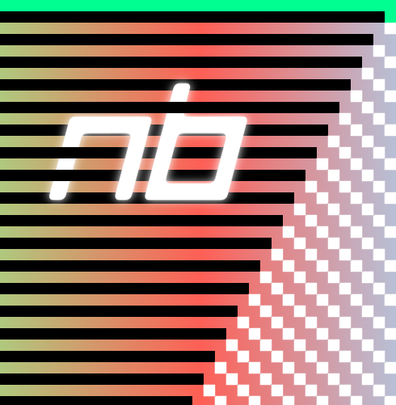

<h1 align="center">- Welcome to neerb's GitHub Account -</h1>

:earth_americas: My Website: http://www.nbreen.dev

  

----------------------------------------------------------------------------------------------------------

<h2 align="">A Few Projects</h2>

<h2 align="">Technologies</h2>

<h2 align="">Connect with Me</h2>

**Email:** [natbreenx@gmail.com](mailto:natbreenx@gmail.com)

----------------------------------------------------------------------------------------------------------

<!--

-->

<!--
**neerb/neerb** is a ✨ _special_ ✨ repository because its `README.md` (this file) appears on your GitHub profile.

Here are some ideas to get you started:

- 🔭 I’m currently working on ...
- 🌱 I’m currently learning ...
- 👯 I’m looking to collaborate on ...
- 🤔 I’m looking for help with ...
- 💬 Ask me about ...
- 📫 How to reach me: ...
- 😄 Pronouns: ...
- ⚡ Fun fact: ...
-->
